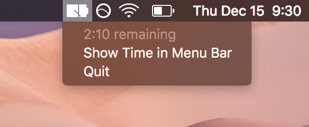
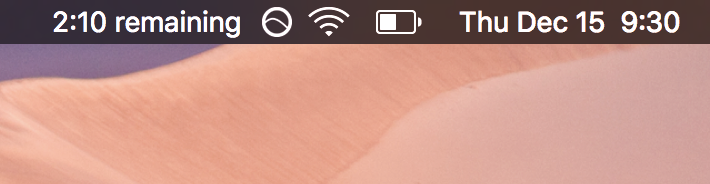

# BatteryBar

This is a dumb, dumb, dumb dead simple battery remaining menu bar app for macOS.

If you didn't know, Apple has [removed the time remaining indicator](http://www.macrumors.com/2016/12/13/macos-sierra-10-12-2-battery-life-indicator/) from macOS Sierra 10.12.2.

# Build

Open the `.xcodeproj` file with Xcode and press play. You're done? Or you can just snag a build from the [releases](https://github.com/steverichey/batterybar/releases) tab.

# License

&copy; 2016 [Steve Richey](https://github.com/steverichey). Shared under an [MIT license](https://en.wikipedia.org/wiki/MIT_License). See [license.md](./license.md) for details.

