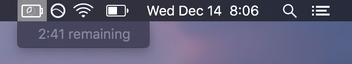

# BatteryBar

This is a dumb, dumb, dumb dead simple battery remaining menu bar app for macOS 10.12.2.

# Build

Open the `.xcodeproj` file with Xcode and press play. You're done? Right now it only actually grabs the time remaining once but this is just a proof of concept because removing time remaining is dumb. It would be pretty easy to grab the time every few seconds or whatever so if you want me to do that open an issue or something.

# Credits

* [Clock Icon](https://thenounproject.com/term/clock/469417/)
* [Battery Icon](https://thenounproject.com/term/battery/587806/)

# License

&copy; 2016 [Steve Richey](https://github.com/steverichey). Shared under an [MIT license](https://en.wikipedia.org/wiki/MIT_License). See [license.md](./license.md) for details.

